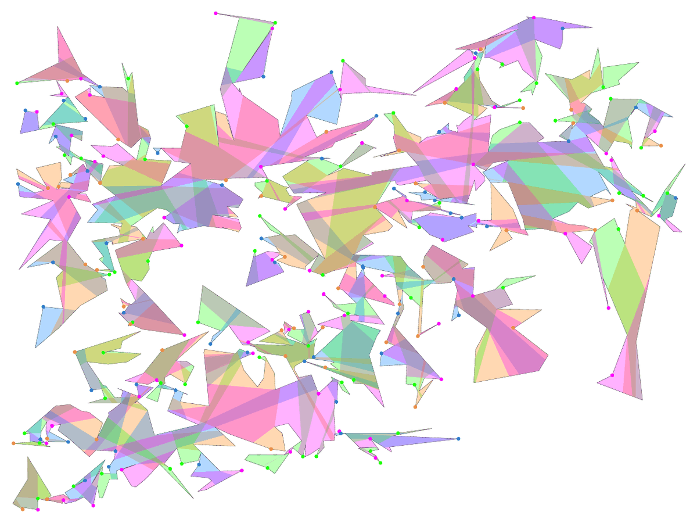
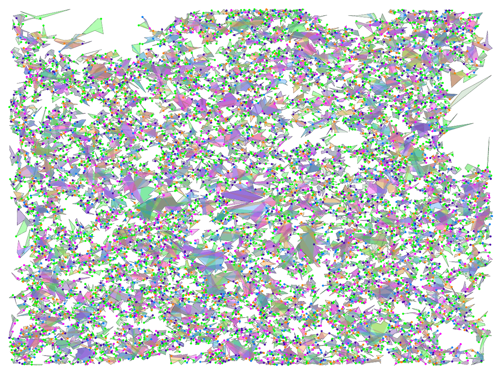

# CAGP-Solver

Exact solvers for the **Chromatic Art Gallery Problem** (CAGP) and its **conflict-free** variant (CFCAGP) with vertex guards. The geometry runs in C++ on [CGAL](https://www.cgal.org/). The models are solved with SAT ([PySAT](https://pysathq.github.io/)), MIP ([Gurobi](https://www.gurobi.com/)) and CP-SAT ([OR-Tools](https://developers.google.com/optimization)).

This is the code of my bachelor's thesis, *Computing Optimal Solutions for the Chromatic Art Gallery Problem* (TU Braunschweig, Algorithms Division, 2024).

| 1,000 vertices | 40,000 vertices |
| :---: | :---: |
|  |  |

*Optimal solutions found by the SAT solver on random polygons from the Salzburg Database. Each dot is a guard, drawn with its visibility region in the guard's color. Regions of the same color never overlap.*

## The problem

Place guards on the vertices of a polygon so that every point is seen by at least one guard. Then color the guards with as few colors as possible, so that no two guards of the same color see a common point. The motivation is frequency assignment for indoor wireless or infrared transmitters: transmitters whose ranges overlap need different frequencies, and the spectrum offers only a few.

In the conflict-free variant, every point only needs one guard whose color is unique among the guards that see it.

Both problems are NP-hard. The only earlier practical work ([Zambon et al., SEA 2014](https://doi.org/10.1007/978-3-319-07959-2_6)) used MIP and tested polygons with up to 2,500 vertices.

## Results

All runs used a 600-second time limit on an AMD Ryzen 7 7800X3D with 28 GB of RAM (WSL2).

| Benchmark | Gurobi (MIP) | SAT (PySAT) | CP-SAT (OR-Tools) |
| --- | --- | --- | --- |
| Random simple polygons, 100–2,500 vertices (480 instances) | All solved; mean 7.8 s at 2,500 vertices | All solved; every run under 0.5 s; mean 0.07 s at 2,500 vertices | All solved; mean 6.4 s at 2,500 vertices (SAT model) |
| Largest random polygon solved (Salzburg fpg, 1,000–40,000 vertices) | 9,000 vertices | **40,000 vertices** (156 s) | 9,000 vertices (SAT model) |
| Random polygons with holes, 100–1,000 vertices, 10–100 holes (300 instances) | 280 solved | 293 solved; fastest on 211 of 300 | 291–293 solved |

- SAT solved polygons 16 times larger than the largest tested in prior work. Larger instances ran out of memory in the geometric preprocessing, not in the solver.
- For the conflict-free variant, this is the first practical study. SAT solves random polygons without holes with up to 2,500 vertices and most polygons with 300 vertices and 30 holes. MIP solved only 10 of 30 polygons without holes with 300 vertices.

## How it works

1. **Visibility.** Every vertex is a candidate guard. CGAL computes each guard's visibility polygon with triangular expansion.
2. **Witnesses.** Overlaying all visibility polygons (recursively, divide and conquer) gives the arrangement of atomic visibility polygons (AVPs). Covering one witness in each *shadow* AVP covers the whole polygon. The guard sets of the *light* AVPs are cliques that cover every edge of the visibility graph, so the graph needs no pairwise intersection tests.
3. **Upper bound.** A greedy algorithm repeatedly takes a maximum-weight independent set of guards as the next color class until every witness is covered.
4. **Exact solving.**
   - **SAT:** decides feasibility for a fixed number of colors. A binary search finds the minimum, and a linear ascent follows when new witnesses are added.
   - **MIP:** uses clique edge cover constraints, with a different cover for each color to break symmetry, and adds missing witnesses as lazy constraints.
   - **CP-SAT:** runs both models.
5. **Lazy witnesses.** The CAGP solvers start with the |G| witnesses that are seen by the fewest guards, and add missing witnesses only when a solution leaves part of the polygon uncovered.

## Installation

Requirements:

- Linux or WSL2 (other platforms are untested)
- Python 3.10 to 3.13
- a C++17 compiler

pip installs CMake, Ninja and Conan for the build. Conan then fetches CGAL (5.6 or newer) and fmt, so the first build takes a few minutes.

```bash
git clone https://github.com/JanSiemsen/CAGP-Solver.git
cd CAGP-Solver
pip install -v .
pip install gurobipy python-sat ortools rustworkx networkx tqdm
```

Gurobi is needed for the MIP solver and for the greedy upper bound that every solver starts from. `pip install gurobipy` comes with a size-limited license that handles the 100-vertex example below but already fails at 200 vertices. Academic licenses are free.

## Quick start

Run from the repository root:

```python
from pathlib import Path

from CAGP_Solver import (
    Point,
    PolygonWithHoles,
    CAGPSolverSAT,
    generate_solver_input,
    get_greedy_solution,
    verify_solver_solution,
)


def read_pol(path):
    """Read a polygon without holes in the AGP .pol format: n, then n rational x/y pairs."""
    tokens = Path(path).read_text().split()
    coords = [int(num) / int(den) for num, den in (t.split("/") for t in tokens[1:])]
    return PolygonWithHoles([Point(x, y) for x, y in zip(coords[0::2], coords[1::2])])


polygon = read_pol(
    "benchmark_instances/final_benchmark_instances/agp2009a-simplerand/randsimple-100-1.pol"
)

# Visibility polygons, AVP arrangement, witnesses and the visibility graph G
(guards, guard_to_witnesses, witness_to_guards,
 initial_witnesses, all_witnesses, G) = generate_solver_input(polygon)

# Greedy upper bound K on the number of colors
K, greedy_solution = get_greedy_solution(guard_to_witnesses, all_witnesses, G)

solver = CAGPSolverSAT(K, guard_to_witnesses, witness_to_guards,
                       initial_witnesses, all_witnesses, G)
colors, solution, iterations, num_witnesses, status = solver.solve()

print(status, colors)  # success 3
assert verify_solver_solution(solution, G)  # solution: list of (guard index, color)
```

Input generation and the solvers print their progress as they run.

The conflict-free variant uses its own input, and the CAGP greedy bound stays valid:

```python
from CAGP_Solver import CFCAGPSolverSAT, generate_solver_input_cf, verify_solver_solution_cf

(guards, guard_to_witnesses_cf, witness_to_guards_cf, _, _, all_witnesses_cf,
 guard_to_witnesses, all_witnesses, G) = generate_solver_input_cf(polygon)
K, _ = get_greedy_solution(guard_to_witnesses, all_witnesses, G)

solver = CFCAGPSolverSAT(K, guard_to_witnesses_cf, witness_to_guards_cf,
                         list(all_witnesses_cf), all_witnesses_cf)
colors, solution, iterations, num_witnesses, status = solver.solve()
assert verify_solver_solution_cf(solution, witness_to_guards_cf)
```

## Solvers

| Problem | Class | Backend | Extra input |
| --- | --- | --- | --- |
| CAGP | `CAGPSolverSAT` | PySAT; CaDiCaL 1.0.3 by default, any PySAT solver via `solver_name` | none |
| CAGP | `CAGPSolverMIP` | Gurobi | `generate_edge_clique_covers(G, K)` and the greedy solution |
| CAGP | `CAGPSolverCPSAT_SAT` | OR-Tools CP-SAT | none |
| CAGP | `CAGPSolverCPSAT_MIP` | OR-Tools CP-SAT | edge clique covers and the greedy solution |
| CFCAGP | `CFCAGPSolverSAT`, `CFCAGPSolverMIP`, `CFCAGPSolverCPSAT_SAT`, `CFCAGPSolverCPSAT_MIP` | as above | output of `generate_solver_input_cf(polygon)` |

Every `solve()` returns `(colors, solution, iterations, num_witnesses, status)` and stops after 600 seconds with `status == "timeout"`.

## Reproducing the experiments

- `benchmark_instances/` holds the benchmark polygons in `.pol` format. They come from the instance sets of de Rezende, de Souza and coauthors (Couto et al. 2009; Crepaldi et al. 2013).
- `evaluations/CAGP/` and `evaluations/CFCAGP/` hold one [AlgBench](https://github.com/d-krupke/AlgBench) script per experiment, plus `*_processing.py` scripts that produce the tables and plots.
- `benchmarks/` holds the raw AlgBench results behind every table in the thesis.
- The large random polygons come from the [Salzburg Database of Geometric Inputs](https://sbgdb.cs.sbg.ac.at/) (`sbgdb-20200507`, `polygons/random/fpg`). Download it separately.

The scripts still contain absolute paths from my machine, as does `src/CAGP_Solver/fpg_conversion.py`. Point them to your checkout before running.

## Repository layout

```text
src/CAGP_Solver/       Python package and the C++ CGAL bindings (_cgal_bindings.cpp)
benchmark_instances/   benchmark polygons (.pol)
evaluations/           experiment, table and plot scripts
benchmarks/            raw experiment results (AlgBench)
plots/                 cactus plots and plots of solved instances
Thesis/                LaTeX source of the thesis
```

## Thesis

Jan Siemsen. *Computing Optimal Solutions for the Chromatic Art Gallery Problem.* Bachelor's thesis, Algorithms Division, TU Braunschweig, 2024. Reviewers: Prof. Dr. Sándor Fekete and Prof. Dr. Roland Meyer. Supervisors: Dominik Krupke and Phillip Keldenich.

The CGAL bindings and the plotting code build on templates by Dominik Krupke.

## License

GPL-3.0-or-later, see [LICENSE](LICENSE). The code links against CGAL packages that are released under the GPL (2D Arrangements, 2D Visibility).

## 概要（日本語）

頂点ガードによる彩色美術館問題（Chromatic Art Gallery Problem）と、そのコンフリクトフリー版を厳密に解くソルバーです。CGAL で可視領域を計算し、MIP（Gurobi）・SAT（PySAT）・CP-SAT（OR-Tools）の定式化を比較しました。SAT を用いることで、先行研究で検証された最大規模（2,500頂点）の16倍にあたる、穴のない4万頂点の多角形でも最適解を求めました（ブラウンシュヴァイク工科大学 学士論文、2024年）。
